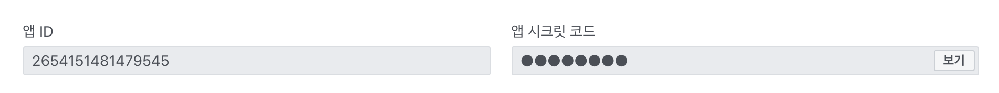
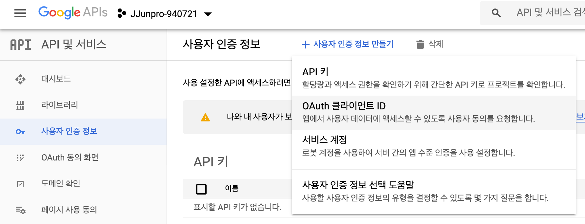
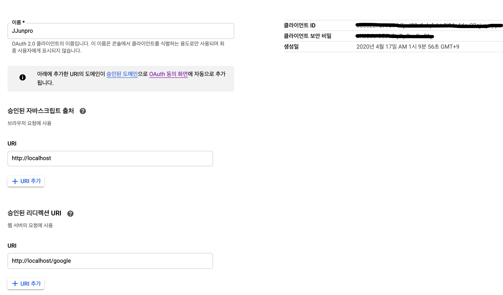
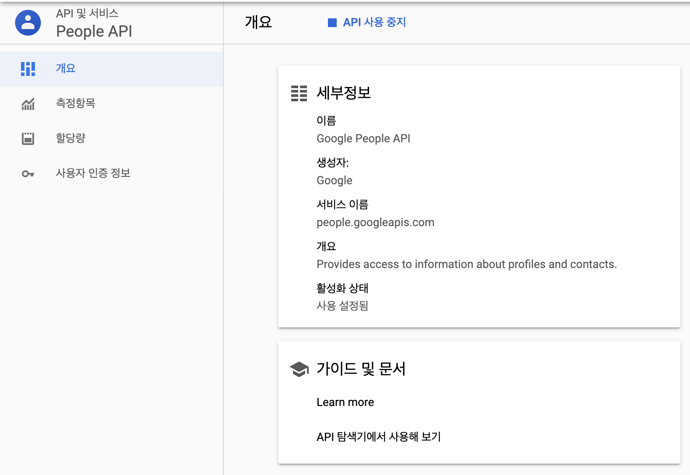
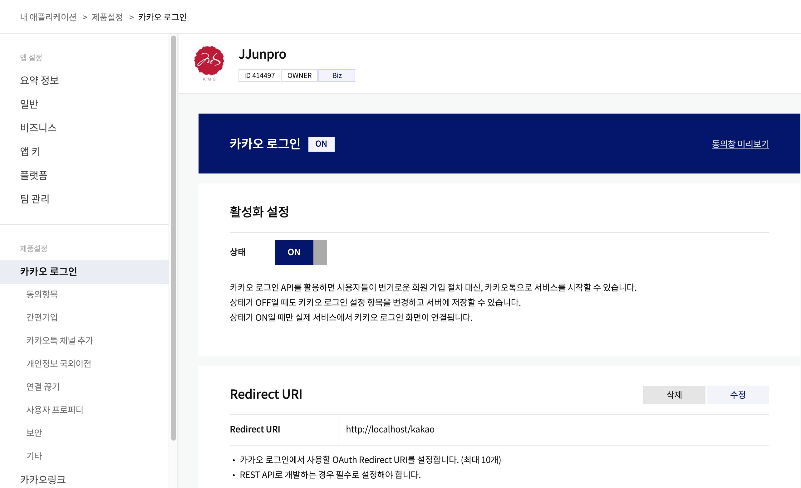
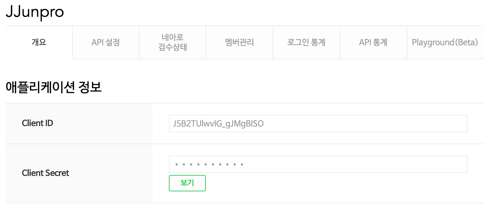
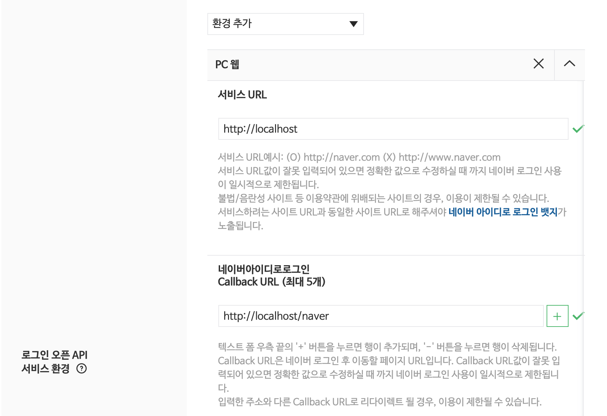
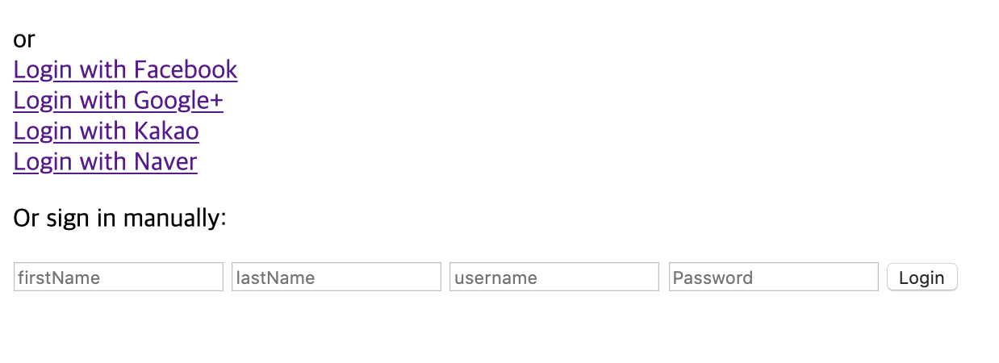

--------------------
# Java Spring OAuth
--------------------

# Google, Facebook, Naver, Kakao OAuth 인증

Google {google-api-services-people} 의존성을 커스텀하여 `Naver, Kakao OAuth 인증 기능을 library` 로 만들었습니다.

# OAuth 인증 library 적용방법

아직 local jar 의존성 등록 이외에는 시도해 본적이 없어서 번거롭습니다..  
하지만 이것또한 좋은것 같습니다.  
이글을 보는 유저가 해당 `library 의 부족한 점이 발견되거나 편의성을 추가하고 싶어 수정`하고 싶으면  
쉽게 수정하고 사용할 수 있다는 `장점도 존재`한다 생각합니다.  

1. oauth-library 폴더의 프로젝트의 jar 생성하면 `OAuth-1.0.0.jar` 이름의 jar 생성됩니다.
2. project 폴더의 최 상위폴더에 lib 폴더를 생성 후 `OAuth-1.0.0.jar` 파일을 넣습니다.
3. project `build.gradle` dependencies 추가합니다.

~~~
dependencies {
    /* OAuth 인증 의존성 */
    dependencies { compile files('lib/OAuth-1.0.0.jar') }
    implementation 'com.google.apis:google-api-services-people:v1-rev528-1.25.0'
    implementation 'org.springframework.social:spring-social-facebook:2.0.3.RELEASE'
}
~~~

# OAuth 개발자 인증등록

각각의 홈페이지에 접속하여 홈페이지를 등록하여 인증정보 id, secret 을 가져옵니다.

- FaceBook
    - https://developers.facebook.com/apps/2654151481479545/settings/basic/

- Google
    - https://console.developers.google.com/?hl=ko
    - https://console.developers.google.com/apis/api/people.googleapis.com/overview?project=680028727789

- Kakao
    - https://developers.kakao.com/apps/414497/settings/user

- Naver
    - https://developers.naver.com/apps/#/myapps/J5B2TUlwvIG_gJMgBISO/overview

# application-social.properties

각각의 sns 인증 정보를 전달받기 위해서 `application-social.properties` 생성합니다.
위 링크에서 얻은 정보를 아래 properties 적절하게 값을 넣습니다.

> application-social.properties

~~~
# FaceBook
default.facebook.uri=http://localhost/facebook
spring.social.facebook.app-id=
spring.social.facebook.app-secret=

# Google
default.google.uri=http://localhost/google
spring.social.google.app-id=
spring.social.google.app-secret=

# Kakao
# https://developers.kakao.com/apps/414497/settings/user
default.kakao.uri=http://localhost/kakao
spring.social.kakao.app-id=
spring.social.kakao.app-secret=

# Naver
# https://developers.naver.com/apps/#/myapps/J5B2TUlwvIG_gJMgBISO/overview
default.naver.uri=http://localhost/naver
spring.social.naver.app-id=
spring.social.naver.app-secret=
~~~

# Controller, Service 생성

> example-project

예제 프로젝트에 존재하는 Controller, Service 주의깊게 봐주시고 사용자의 프로젝트에 적절하게 적용해 주세요.

Google & Facebook 은 인증완료시 받아오는 Scope 설정이 Service 에서 설정 가능하지만  
Kakao & Naver 는 library 에서 수정해야 합니다. (고쳐야할 부분..)  
주로 Controller 에서는 SNS OAuth 인증으로 AccessToken(인증요청) 을 전송하고 AccessToken(인증결과) 을 전달받는 과정을 수행합니다.  
Service 에서는 Controller 에서 전달받은 AccessToken 을 가공하거나 인증이 완료되어 전달받은 사용자의 정보를 DTO로 전달받는 과정을 수행합니다.  
Controller, Service 좀더 유연하게 커스텀하면 해당 기능에서 좀더 많은 기능을 추가하여 인증로직을 완성할 수 있을것입니다.  
나머지는 example-project 의 Controller, Service 에 주석으로 작성해 놨으니 참고해주시기 바랍니다.

# 결과

페이스북 인증된 사용자의 이름값을 가져와 정상적으로 출력하였습니다.